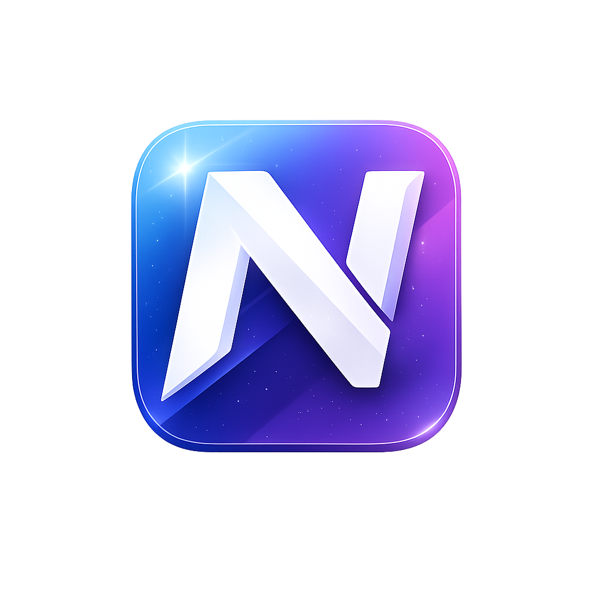

# Nuvio

### Know your next step.

**AI-powered developer guidance from learning to getting hired.**

---

---

# 🚀 About Nuvio

Nuvio is an AI-powered platform built to guide aspiring software developers throughout their learning journey.

Instead of overwhelming users with endless tutorials and scattered roadmaps, Nuvio provides personalized guidance, structured learning paths, project recommendations, and career-focused mentoring based on each user's goals and progress.

Our mission is simple:

> **Help every developer know their next step.**

---

# ✨ Core Features

- 🤖 AI Developer Mentor
- 🗺️ Personalized Learning Roadmaps
- 🎯 Daily Next-Step Recommendations
- 📈 Progress Tracking
- 💼 Career Guidance
- 📚 Curated Learning Resources
- 🚀 Project Recommendations
- 🎤 Interview Preparation
- 🔒 Secure Authentication
- 👤 Personalized Developer Profiles

---

# 🌍 Vision

Learning to code shouldn't feel confusing.

Nuvio aims to become the personal mentor every developer wishes they had—guiding learners from their first line of code to their first software engineering job.

---

# 🛠 Technology Stack

### Frontend

- React
- TypeScript
- Vite
- React Router

### Backend

- Node.js
- Express
- TypeScript

### Database

- Supabase
- PostgreSQL

### Tools

- Git
- GitHub
- VS Code

---

# 📈 Roadmap

### ✅ Phase 1

- Authentication
- User Profiles
- Onboarding
- Dashboard

### 🚧 Phase 2

- Guidance Engine
- Personalized Learning Journey
- Progress Tracking

### 🔜 Phase 3

- AI Mentor
- AI Roadmap Generator
- Smart Recommendations

### 🌎 Phase 4

- Community
- Resume Review
- Mock Interviews
- Job Matching

---

# 💡 Philosophy

Technology changes.

Learning paths change.

Jobs change.

But one thing never changes:

> Every developer deserves to know their next step.

---

# 🤝 Contributing

Contributions, ideas, and feedback are always welcome.

Please open an issue or submit a pull request to help improve Nuvio.

---

# 📄 License

Licensed under the MIT License.

---

## Built with ❤️ by Ansh Gajjar

### ⭐ If you believe in the vision, consider starring the repository.

**Know your next step.**

